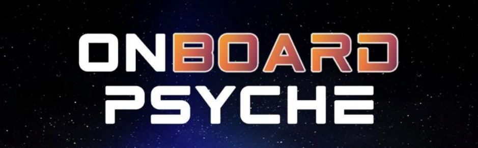

# About
Embark on an adventure through space with our interactive web game, inspired by NASA’s Psyche mission. Discover the asteroid Psyche while uncovering the mission’s real-life objectives. Our game offers entertainment and education, inviting individuals to explore the wonders of space exploration through immersive gameplay.

# Installation

# Development
Prerequisites:

# How To Use

# Developers

+ Luke James
+ Edith Avalos-Perez
+ Kavya Kannan
+ Alex Prill

  

